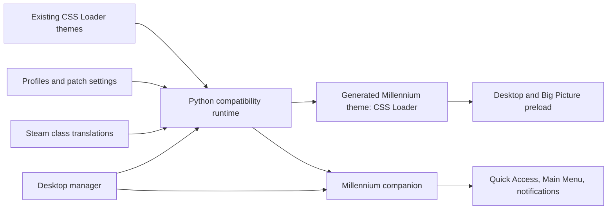

# Architecture

CSS Loader for Millennium keeps CSS Loader's theme format and configuration
model, but changes how the final styles reach Steam.

## Runtime compiler

`runtime/backend` retains CSS Loader's manifest reader, dependency handling,
patch components, profiles, class translation, and theme-store integration. It
compiles enabled payloads in activation order, rewrites local asset URLs, and
writes a normal Millennium theme named **CSS Loader**.

The generated theme is persisted on disk. Millennium can therefore load its
main Desktop and Big Picture CSS during Steam startup without waiting for the
desktop manager or a late browser injection pass.

## Millennium companion

Steam renders Quick Access, Main Menu, and notification toasts in isolated
BrowserViews. `plugins/millennium` live-syncs only those isolated targets using
Millennium's per-plugin Chrome DevTools Protocol proxy.

This is not an external CDP setup: the project does not open port 8080, require
Steam developer mode, or run a separate browser bridge. The generated theme
remains the primary runtime and startup path.

## Desktop manager

`apps/desktop` is a Tauri application for browsing installed themes, changing
profiles and patch settings, installing the bundled backend, and installing or
enabling the companion plugin. Release builds embed both runtime artifacts so
the installer does not replace them with an unrelated upstream backend.

## Data flow and ordering

CSS Loader's cascade order is observable behavior. Toggling a component removes
its old payload and appends its replacement, so the compiler tracks activation
order rather than sorting by theme name or file path. Target bundles are kept
separate; Quick Access or Main Menu CSS is never folded into Big Picture merely
because all three are gamepad UI surfaces.
