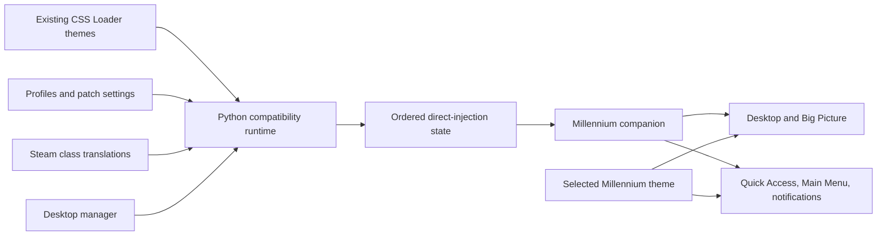

# Architecture

CSS Loader for Millennium keeps CSS Loader's theme format and configuration
model, but changes how the final styles reach Steam.

The adapter is required because stock CSS Loader relies on an external CDP
endpoint and creates Steam's `.cef-enable-remote-debugging` marker. Millennium
removes that deprecated marker during its startup health/safety checks and only
exposes an external debugging port in `-dev` mode. This project retains CSS
Loader's theme/configuration behavior while replacing that incompatible
injection path.



## Runtime publisher

`runtime/backend` retains CSS Loader's manifest reader, dependency handling,
patch components, profiles, class translation, and theme-store integration. It
publishes every enabled payload in activation order without flattening bundles,
rewriting asset URLs, or parsing nested CSS constructs. File-backed injects are
read from their original source so legacy JavaScript-string escaping cannot
leak into the direct protocol.

CSS Loader's existing `/themes_custom/...` contract is preserved. When Steam's
`themes_custom` path is not linked to the homebrew library, the publisher mirrors
active theme files there without modifying their CSS.

The publisher atomically writes `runtime-state.json` followed by a small
`build-report.json` revision. The companion accepts a state only when both
content hashes match. The user's selected Millennium theme remains untouched,
and CSS Loader's ordered style elements are layered over it.

### Catalog target scopes

DeckThemes keeps UI-mode categories such as `Desktop-Store` and `Store` in its
catalog API rather than the downloaded `theme.json`. The backend caches that
metadata beside each UUID-backed theme in `.css-loader-catalog.json` and
publishes the resolved `desktop`, `gamepad`, or `all` scope with every runtime
injection. Existing official themes are backfilled from the catalog on backend
startup, and newly downloaded themes are cached during installation.

Themes without catalog metadata preserve stock CSS Loader's unrestricted
matching behavior. A manually installed theme can opt into an explicit mode by
creating `.css-loader-scope.json` beside `theme.json` with one of:

```json
{ "scope": "desktop" }
```

```json
{ "scope": "gamepad" }
```

`all` is also accepted and is the default. This separate override avoids
modifying third-party theme manifests.

## Millennium companion

The separately maintained
[CSS Loader Companion for Millennium](https://github.com/DevsNate/CSSLoader-Companion-Millennium)
is distributed independently through its own repository and is the primary
runtime. It reconciles individual `<style>` elements in Desktop and Big
Picture, then does the same for Quick Access, Main Menu, and notification toasts
through Millennium's per-plugin Chrome DevTools Protocol proxy because those
targets live in isolated BrowserViews.

The companion also tracks Steam's active UI mode. Catalog-scoped styles are
removed and reapplied during Desktop/Gamepad transitions, preventing a
`Desktop-Store` theme from styling Big Picture's Store BrowserView even though
both pages use the same `store.steampowered.com` URL.

This is not an external CDP setup: the project does not open port 8080, require
Millennium `-dev` mode, or run a separate browser bridge. The generated runtime
mailbox lives inside the installed companion and does not create or select a
Millennium theme.

## Desktop manager

`apps/desktop` is a Tauri application for browsing installed themes, changing
profiles and patch settings, and running the bundled onedir backend. The
separately released companion is neither bundled nor modified by the desktop
installer, and `themes.activeTheme` remains untouched.

On a clean machine, first launch is an idempotent bootstrap: it creates the
theme library, removes legacy onefile Startup copies, registers the installed
onedir launcher for login startup, and starts the publisher. The publisher
requires the separately installed companion and writes only to its `runtime`
subdirectory.

## Data flow and ordering

CSS Loader's cascade order is observable behavior. Toggling a component removes
its old payload and appends its replacement, so the publisher tracks activation
order rather than sorting by theme name or file path. Each payload retains its
own target match; Quick Access or Main Menu CSS is never folded into Big Picture
merely because all three are gamepad UI surfaces.
