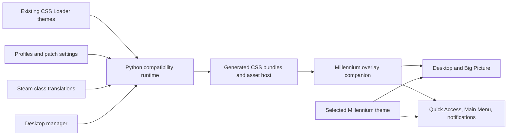

# Architecture

CSS Loader for Millennium keeps CSS Loader's theme format and configuration
model, but changes how the final styles reach Steam.

The adapter is required because stock CSS Loader relies on an external CDP
endpoint and creates Steam's `.cef-enable-remote-debugging` marker. Millennium
removes that deprecated marker during its startup health/safety checks and only
exposes an external debugging port in `-dev` mode. This project retains CSS
Loader's theme/configuration behavior while replacing that incompatible
injection path.

## Runtime compiler

`runtime/backend` retains CSS Loader's manifest reader, dependency handling,
patch components, profiles, class translation, and theme-store integration. It
compiles enabled payloads in activation order, rewrites local asset URLs, and
writes a Millennium-served asset host whose optional selector entry is named
**CSS Loader (Standalone)**.

The generated bundles are persisted on disk, so the desktop manager does not
need to be running when Steam starts. Overlay mode leaves the user's selected
Millennium theme untouched and layers the last compiled CSS Loader state over
it. Selecting **CSS Loader (Standalone)** remains available for a CSS
Loader-only presentation.

## Millennium companion

The separately maintained
[CSS Loader Companion for Millennium](https://github.com/DevsNate/CSSLoader-Companion-Millennium),
pinned into this repository at `plugins/millennium` for release builds, is the
primary overlay runtime. It synchronizes Desktop
and Big Picture directly inside Steam, then reaches Quick Access, Main Menu,
and notification toasts through Millennium's per-plugin Chrome DevTools
Protocol proxy because those targets live in isolated BrowserViews.

This is not an external CDP setup: the project does not open port 8080, require
Millennium `-dev` mode, or run a separate browser bridge. The generated theme
directory is a persistent content host; it does not need to be the active
Millennium theme.

## Desktop manager

`apps/desktop` is a Tauri application for browsing installed themes, changing
profiles and patch settings, installing the bundled backend, and installing or
enabling the companion plugin. Installation only enables the companion and
preserves `themes.activeTheme`, making overlay mode the default. Release builds
embed both runtime artifacts so the installer does not replace them with an
unrelated upstream backend.

On a clean machine, first launch is an idempotent bootstrap: it creates the
theme library, copies the backend, installs or migrates the companion, preserves
the selected Millennium theme, and then starts the compiler. The generated
Millennium theme folder is user-specific runtime output and is not published as
a theme repository.

## Data flow and ordering

CSS Loader's cascade order is observable behavior. Toggling a component removes
its old payload and appends its replacement, so the compiler tracks activation
order rather than sorting by theme name or file path. Target bundles are kept
separate; Quick Access or Main Menu CSS is never folded into Big Picture merely
because all three are gamepad UI surfaces.
